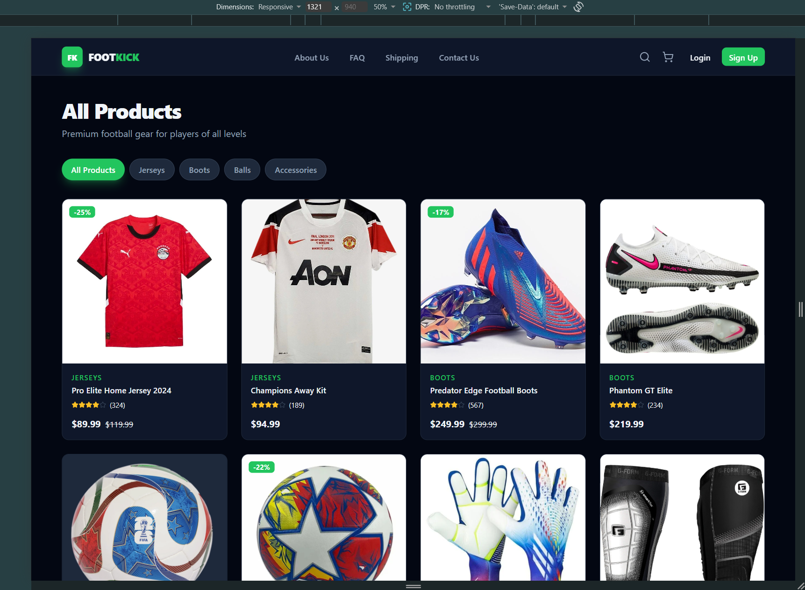
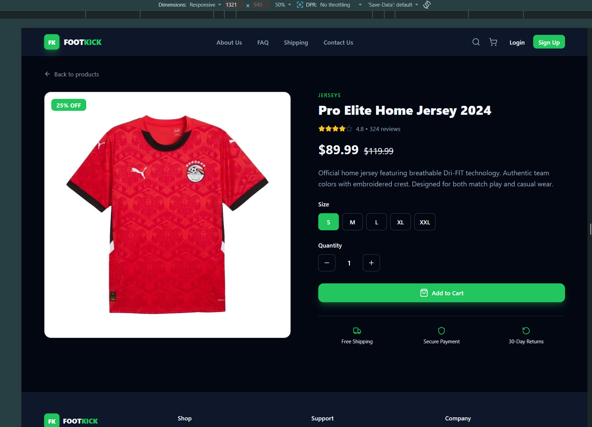
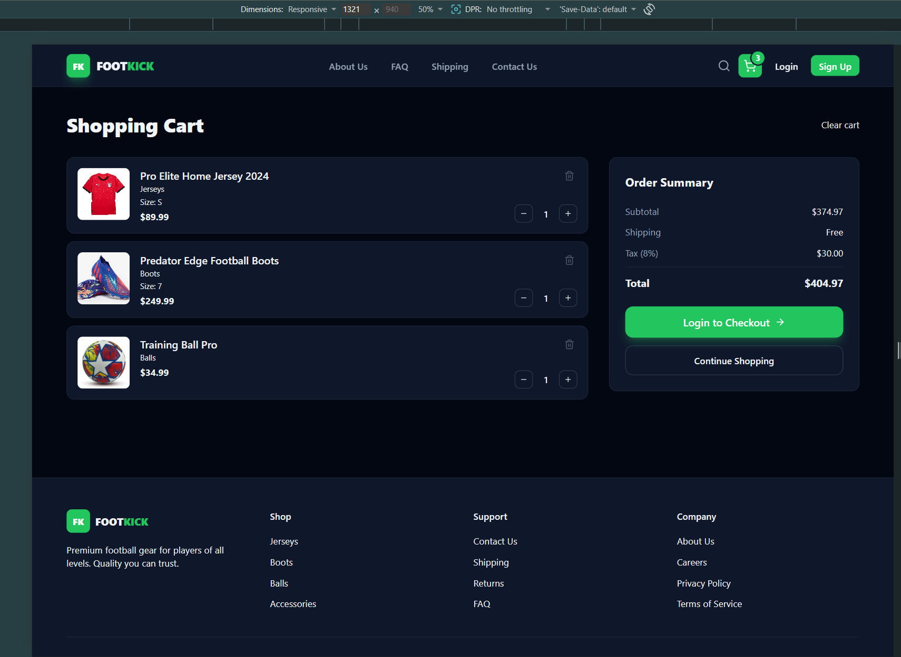
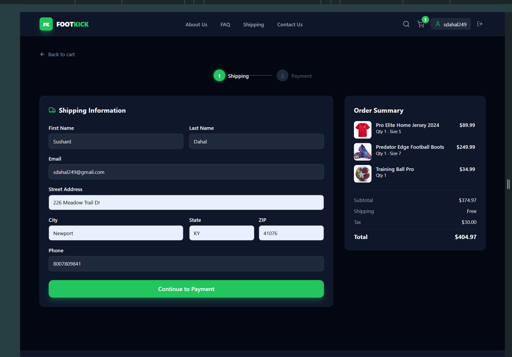
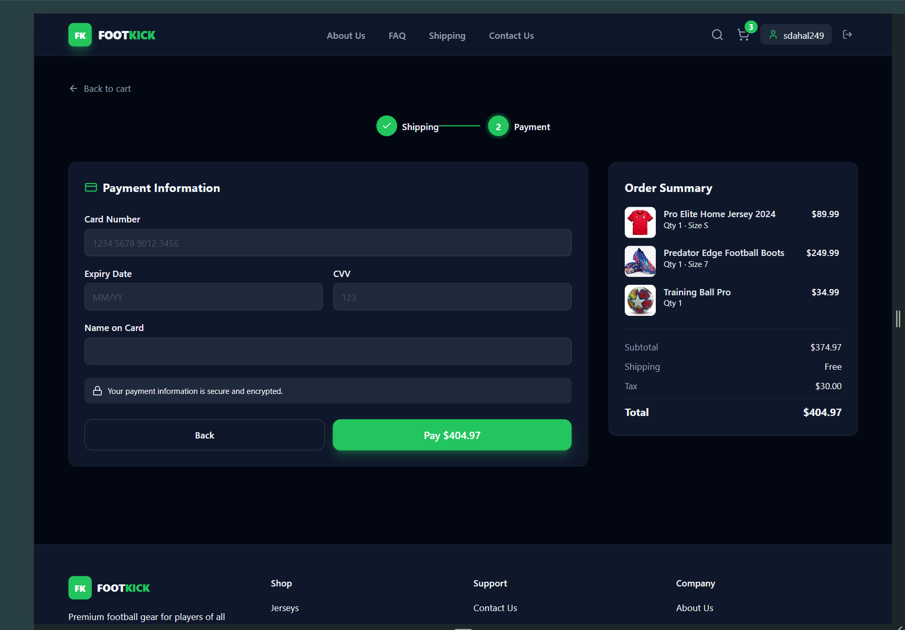
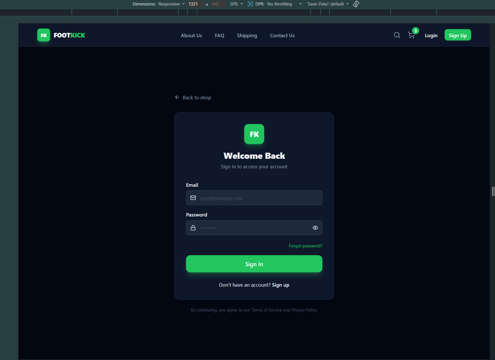

<div align="center">

# ⚽ FootKick

### Premium Football Gear — E-commerce Frontend Application

Built with **React 18**, **Redux Toolkit**, **Vite**, and **Tailwind CSS**

</div>

---

## 📋 Project Overview

FootKick is a fully responsive, single-page e-commerce application for premium football equipment. It was built as a multi-phase frontend project demonstrating professional React development patterns — from basic component design through to global state management, custom hooks, protected routes, and a complete multi-step checkout experience.

Users can browse a catalogue of 12 real products across four categories, filter and search in real time, view detailed product pages, manage a shopping cart, and complete a two-step checkout — with authentication required before payment.

The application includes a full site structure with navigable pages for About Us, FAQ, Shipping Policy, Returns, Careers, Privacy Policy, and Terms of Service — all styled to match the dark theme.

---

## 📸 Screenshots

### Home — Product Listing



&nbsp;

### Product Detail Page



&nbsp;

### Shopping Cart



&nbsp;

### Checkout Flow




&nbsp;

### Login / Register



---

## ✨ Features

### 🛍️ Shopping Experience
- Browse **12 real products** across Jerseys, Boots, Balls, and Accessories
- **Category filter pills** and **live search** — results update as you type
- **Product detail page** with size selector, quantity control, and add-to-cart
- **Quick-add button** on each card — add to cart without leaving the grid
- Sale badges showing calculated discount percentages
- Out-of-stock overlay with disabled purchase controls
- Real product photography (locally hosted images)

### 🛒 Cart & Checkout
- Add, remove, and update item quantities from the cart
- Same product in different sizes treated as separate entries
- Automatic **shipping calculation** (free over $100) and **8% tax**
- **Two-step checkout**: Shipping Information → Payment Details
- Form pre-filled with logged-in user's name and email
- Simulated payment processing with loading state and order confirmation

### 🔐 Authentication
- Register and Login forms with client-side validation
- Auth state managed globally via Redux
- **Checkout is protected** — unauthenticated users are redirected to Login, then forwarded directly to Checkout after signing in
- User name displayed in the header when logged in; logout clears session

### 📄 Site Pages (Fully Navigable)
| Page | Description |
|---|---|
| Product Listing | Filterable, searchable product grid |
| Product Detail | Full product view with size/quantity selectors |
| Cart | Item management and order summary |
| Checkout | Two-step shipping and payment form |
| About Us | Company story, stats, values, and team |
| FAQ | Accordion-style help centre across 4 categories |
| Shipping | Delivery tiers, regional estimates, order journey |
| Returns | 30-day return policy and step-by-step process |
| Careers | Company perks and open job listings |
| Privacy Policy | Full data and cookie policy |
| Terms of Service | Site usage terms and conditions |
| Contact Us | Contact info cards and working inquiry form |

### 📱 Responsive Design
- **Mobile-first** layout built with Tailwind CSS utility classes
- Collapsible hamburger navigation on small screens
- Product grid adapts: 2 columns (mobile) → 3 (tablet) → 4 (desktop)
- Cart, Checkout, and all content pages reflow cleanly at every breakpoint
- Sticky header with inline search on desktop; full-width search on mobile

---

## 🏗️ Project Structure

```
footkick/
├── public/
├── src/
│   ├── components/
│   │   ├── auth/
│   │   │   └── AuthForms.jsx         # Login & Register forms
│   │   ├── cart/
│   │   │   └── Cart.jsx              # Shopping cart page
│   │   ├── checkout/
│   │   │   └── Checkout.jsx          # Two-step checkout
│   │   ├── layout/
│   │   │   ├── Header.jsx            # Sticky nav with search, cart badge & auth
│   │   │   └── Footer.jsx            # Footer with navigable links
│   │   ├── pages/
│   │   │   ├── AboutUs.jsx           # Company info and team
│   │   │   ├── Careers.jsx           # Job listings
│   │   │   ├── ContactUs.jsx         # Contact form and info
│   │   │   ├── FAQ.jsx               # Accordion FAQ
│   │   │   ├── PrivacyPolicy.jsx     # Privacy policy
│   │   │   ├── Returns.jsx           # Return policy
│   │   │   ├── Shipping.jsx          # Shipping info and tiers
│   │   │   └── TermsOfService.jsx    # Terms of service
│   │   └── products/
│   │       ├── ProductCard.jsx       # Grid card with quick-add
│   │       ├── ProductDetail.jsx     # Full product page
│   │       └── ProductList.jsx       # Filtered and searchable grid
│   ├── hooks/
│   │   ├── useCart.js                # Custom hook — cart logic
│   │   └── useFetchProducts.js       # Custom hook — simulates API fetch
│   ├── images/                       # Local product photography
│   ├── store/
│   │   ├── hooks.js                  # Typed useAppDispatch / useAppSelector
│   │   ├── index.js                  # Redux store configuration
│   │   └── slices/
│   │       ├── authSlice.js          # Auth state (user, isAuthenticated)
│   │       ├── cartSlice.js          # Cart items
│   │       └── productsSlice.js      # Products, filter, search, selected item
│   ├── App.jsx                       # Page routing via useState
│   ├── index.css                     # Tailwind directives and base styles
│   └── main.jsx                      # React root + Redux Provider
├── index.html
├── package.json
├── tailwind.config.js
└── vite.config.js
```

---

## 🔧 Tech Stack

| Technology | Purpose |
|---|---|
| **React 18** | UI library — functional components and hooks throughout |
| **Vite 5** | Development server and production build tool |
| **Redux Toolkit** | Global state management (products, cart, auth) |
| **React Redux** | Provider and `useSelector` / `useDispatch` integration |
| **Tailwind CSS 3** | Utility-first styling and responsive design |
| **Lucide React** | Consistent icon library |

---

## 🚀 Setup & Run Instructions

### Prerequisites
- **Node.js 18+** installed ([nodejs.org](https://nodejs.org))
- **npm** (comes with Node) or **yarn**

### 1. Clone the repository
```bash
git clone https://github.com/dSushant717/footkick.git
cd footkick
```

### 2. Install dependencies
```bash
npm install
```

### 3. Start the development server
```bash
npm run dev
```
Open [http://localhost:5173](http://localhost:5173) in your browser.

### 4. Build for production
```bash
npm run build
```

### 5. Preview the production build
```bash
npm run preview
```

---

## 📐 Development Phases

This project was built incrementally across 7 structured phases:

| Phase | Goal | Key Deliverables |
|---|---|---|
| **Phase 1** | Project Setup & Layout | Vite setup, Header/Footer, `useState` page switching |
| **Phase 2** | Page Components | ProductList, ProductDetail, Cart, Checkout components |
| **Phase 3** | Redux State Management | Store with `productsSlice`, `cartSlice`, `authSlice` |
| **Phase 4** | Hooks & Side Effects | `useFetchProducts` (useEffect), `useCart` (custom hook) |
| **Phase 5** | User Authentication | Login/Register forms, checkout auth guard |
| **Phase 6** | Testing & Debugging | Full user flow tested, console warnings resolved |
| **Phase 7** | Documentation & Submission | README, code comments, organised repository |

---

## 🧠 State Management

Redux Toolkit manages three slices of global state:

```
Redux Store
├── products
│   ├── items[]          — full product catalogue (loaded via useEffect)
│   ├── selectedProduct  — product currently viewed in detail
│   ├── filter           — active category filter ('all' | 'jerseys' | ...)
│   ├── searchQuery      — live search string
│   └── isLoading        — true while simulated API fetch is in-flight
├── cart
│   └── items[]          — { product, quantity, selectedSize }
└── auth
    ├── user             — { name, email } of logged-in user
    ├── isAuthenticated  — boolean gate for checkout access
    └── error            — login/register error message
```

---

## 🪝 Custom Hooks

### `useFetchProducts`
Simulates loading the product catalogue from a remote API. On mount it dispatches `setLoading(true)`, waits 800 ms, then dispatches `loadProducts` with the full catalogue — making the loading spinner visible on every fresh page load.

### `useCart`
Encapsulates all cart calculations and dispatch calls. Returns `{ items, totalItems, subtotal, shipping, tax, total, add, remove, update, clear }` so any component can interact with the cart without touching Redux directly.

---

<div align="center">

&copy; 2024 FootKick. All rights reserved.

</div>
